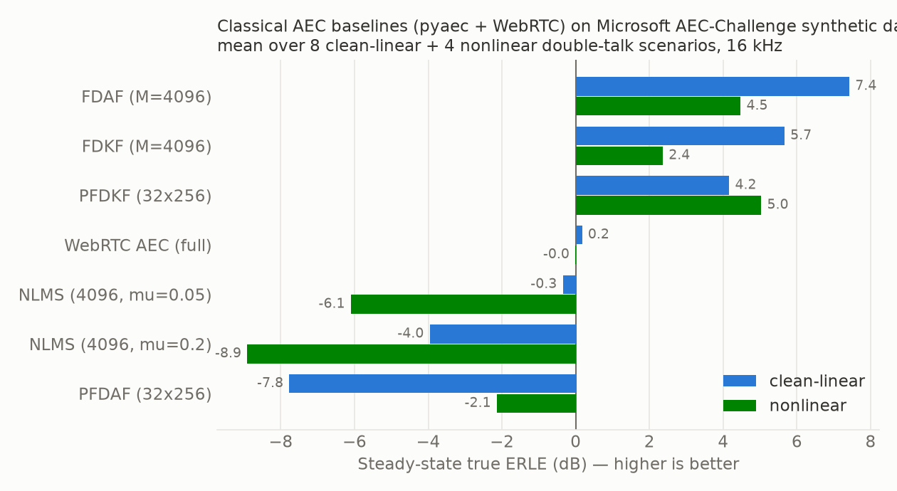
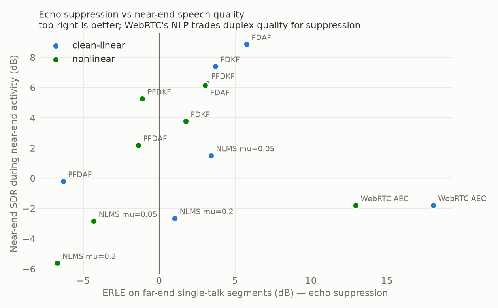
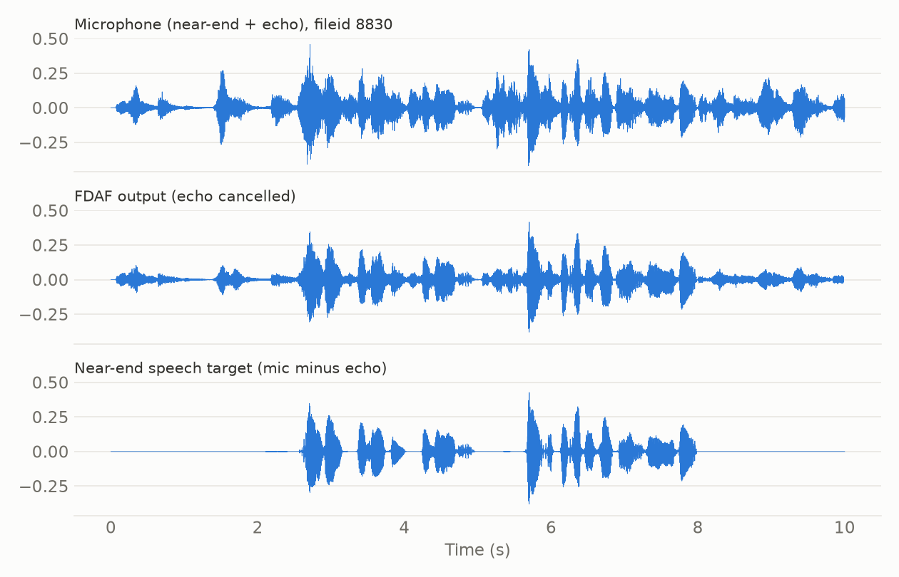
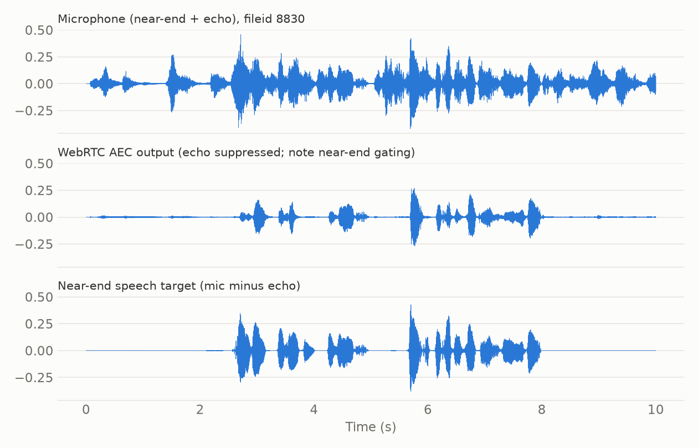
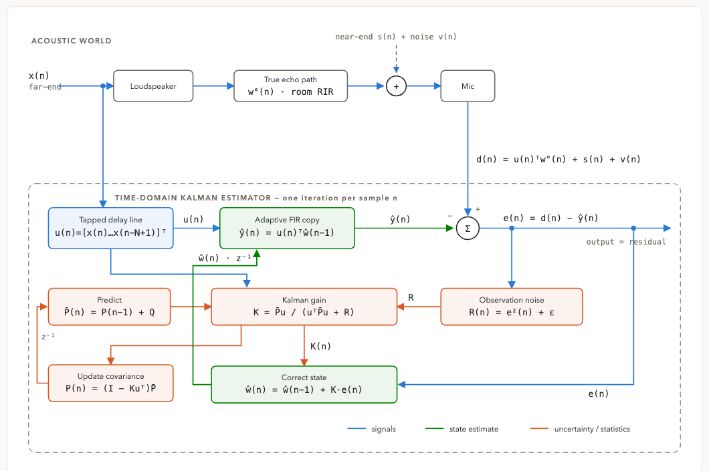

# Classical AEC Baselines on the Microsoft AEC-Challenge Dataset

Benchmarks classical acoustic echo cancellation (AEC) algorithms — the
adaptive filters from [ewan-xu/pyaec](https://github.com/ewan-xu/pyaec) and
**WebRTC's production AEC** via
[python-webrtc-audio-processing](https://github.com/xiongyihui/python-webrtc-audio-processing) —
on the [Microsoft AEC-Challenge](https://github.com/microsoft/AEC-Challenge)
synthetic dataset (ICASSP 2021–2023 challenges).

## Results

Means over 12 double-talk scenarios (8 clean-linear + 4 nonlinear, 16 kHz),
ordered by steady-state true ERLE:

| Algorithm | True ERLE steady | ST-FE ERLE (echo suppression) | Near-end SDR (duplex quality) | RTF |
|---|---|---|---|---|
| FDAF (M=4096, mu=0.1) | **6.4 dB** | 4.9 | 8.0 | 0.004 |
| FDKF (M=4096) | 4.6 | 3.1 | 6.2 | 0.005 |
| PFDKF (32×256) | 4.5 | 1.7 | 6.0 | 0.013 |
| WebRTC AEC (full) | 0.1 | **16.3** | −1.8 | **0.001** |
| NLMS (4096, mu=0.05) | −2.3 | 0.8 | 0.1 | 0.12 |
| NLMS (4096, mu=0.2) | −5.6 | −1.5 | −3.6 | 0.12 |
| PFDAF (32×256, mu=0.1) | −5.9 | −4.7 | 0.6 | 0.004 |



The linear pyaec filters and WebRTC occupy opposite corners of the
suppression/duplex trade-off — WebRTC's nonlinear suppressor (NLP) delivers
by far the strongest echo suppression but gates near-end speech during
far-end activity (half-duplex behavior):



Example on one clean-linear scenario — the linear FDAF preserves near-end
speech, WebRTC suppresses echo far harder but attenuates near-end speech:




See [summary.md](summary.md) for the full analysis, including why the
dataset's time-varying echo delay (15–117 ms, jumping mid-clip) breaks
unaligned adaptive filters, and double-talk divergence of NLMS.

## The algorithms

All rows are adaptive filters learning the echo path (the response from
loudspeaker signal `x` to the echo in the mic) so they can subtract a
predicted echo; they differ in how they adapt:

- **NLMS (4096 taps, mu=0.05 / 0.2)** — time-domain Normalized LMS: every
  sample, nudge all taps down the error gradient, step size normalized by
  input power. No double-talk defense — near-end speech looks like error
  and drives mis-adaptation, which is why both configs go negative here
  (mu=0.2 adapts faster and diverges harder). Per-sample loop over 4096
  taps also makes it the slowest (RTF 0.12).
- **FDAF (M=4096, mu=0.1)** — block NLMS in the FFT domain: one
  4096-sample block per update, bins adapt near-independently, ~30× cheaper.
  Its table win is partly accidental: the single huge block adapts slowly,
  which happens to protect it during double-talk (summary finding 3).
- **PFDAF (32×256, mu=0.1)** — partitioned FDAF: the same filter split into
  32×256-sample partitions, cutting block latency from 256 ms to 16 ms.
  The fast small-block adaptation inherits NLMS's double-talk fragility —
  it goes negative.
- **FDKF (M=4096)** — frequency-domain Kalman filter (Enzner & Vary): the
  echo path is a drifting hidden state (process noise `Q`) observed through
  a noisy mic (`R` from the error spectrum). Near-end speech inflates `R`,
  collapsing the Kalman gain, so the filter freezes itself during
  double-talk instead of diverging — built-in robustness that gradient
  filters only get from an external double-talk detector. See the
  [Kalman background](#background-kalman-filtering-for-aec) below.
- **PFDKF (32×256)** — partitioned FDKF: Kalman machinery at 16 ms block
  latency. Unlike PFDAF, fast adaptation doesn't hurt it — the gain
  provides the protection. Most consistent row across clean/nonlinear
  conditions, and the strongest classical baseline in the literature.
- **WebRTC AEC (full)** — the production system: a linear filter *plus* a
  nonlinear suppressor (NLP) that attenuates residual echo. Fastest (RTF
  0.001) and by far the strongest suppressor (16.3 dB ST-FE ERLE), but the
  NLP gates near-end speech whenever far-end is active (−1.8 dB near-end
  SDR, half-duplex behavior), so the combined true-ERLE metric nets out
  near zero.

In one sentence: gradient filters (NLMS/PFDAF) die under double-talk,
Kalman filters survive it by design, FDAF survives it by accident, and
WebRTC trades duplex transparency for suppression.

## Layout

- `src/benchmark.py` — pyaec benchmark harness (delay alignment + filters + metrics)
- `src/webrtc_benchmark.py` — WebRTC full AEC over the same scenarios/metrics
- `src/make_plots.py` — result figures
- `patches/` — macOS arm64 build fix for python-webrtc-audio-processing
- `plots/` — output figures
- `summary.md` — results and findings
- Not checked in (created locally by the steps below): `AEC-Challenge/`,
  `pyaec/`, `python-webrtc-audio-processing/` (upstream clones), `data/`,
  `results/`, `logs/`, `.venv/`

## Setup / run

```bash
# clones (AEC-Challenge without Git LFS content — pointers only)
git clone --depth 1 https://github.com/microsoft/AEC-Challenge
git clone --depth 1 https://github.com/ewan-xu/pyaec
git clone --recursive --depth 1 https://github.com/xiongyihui/python-webrtc-audio-processing
git -C python-webrtc-audio-processing apply ../patches/python-webrtc-audio-processing-macos-arm64.patch

python3 -m venv .venv && source .venv/bin/activate
pip install numpy scipy soundfile matplotlib pandas
brew install swig && pip install ./python-webrtc-audio-processing

python src/benchmark.py            # pyaec filters
(cd src && python webrtc_benchmark.py)  # WebRTC AEC
python src/make_plots.py           # figures
```

Scenario audio (48 files, ~15 MB; fileids in the scripts'
`data/selected_scenarios.csv`) is fetched per-file from
`https://media.githubusercontent.com/media/microsoft/AEC-Challenge/main/datasets/synthetic/...`
to avoid the multi-GB LFS download.

## Method

Each synthetic scenario provides far-end speech `x`, echo `y`, near-end
speech `s`, and mic signal `d = scale*s + y`. Each AEC produces `e`. Metrics
(all computable exactly thanks to ground-truth echo, valid during double-talk):

- **True ERLE** `10·log10(Σy²/Σr²)`, residual `r = e − (d − y)` — combined
  measure penalizing residual echo and near-end damage.
- **ST-FE ERLE** — classic ERLE over far-end single-talk frames only.
- **Near-end SDR** — near-end speech integrity over near-end-active frames.

A cross-correlation bulk-delay estimator aligns `x` before filtering (as
real AEC front-ends do) — without it the dataset's 40–120 ms time-varying
delay prevents the frequency-domain Kalman filters from adapting at all.

## Background: Kalman filtering for AEC



**Time-domain (pyaec `kalman.py`).** The echo path is treated as a hidden
state: an N-tap FIR filter `w` that drifts as a random walk
(`w(n+1) = w(n) + Δ`, process noise `Q`), observed one noisy scalar at a
time through the mic, `d(n) = uᵀw + v(n)`, where `u` is the last N far-end
samples and `v` is near-end speech + noise. Each sample the filter runs
predict → gain → correct (diagram above): uncertainty `P` grows by `Q`,
the Kalman gain `K = P̄u/(uᵀP̄u + R)` balances that uncertainty against the
observation-noise estimate `R = e²`, and the state moves by `K·e`. Because
near-end speech inflates `R` and collapses the gain, the filter freezes
during double-talk instead of diverging — robustness NLMS only gets from an
external double-talk detector. Special cases: `Q=0`, fixed `R` → RLS;
`P ∝ I` frozen → NLMS with a variable step size. The catch: the full N×N
covariance `P` costs O(N²) per sample — infeasible at the 4096 taps this
dataset needs, which is why it sits out the benchmark.

**Frequency-domain (pyaec `fdkf.py` / `pfdkf.py`, after Enzner & Vary
2006).** Same predict–gain–correct cycle, but run per FFT bin on
overlap-save blocks: the FFT approximately decorrelates speech, so N
independent scalar Kalman filters replace the N×N covariance — O(N log N)
per block instead of O(N²) per sample. `R` becomes a smoothed error
spectrum (`R = βR + (1−β)|E|²`), a better-behaved noise estimate than the
instantaneous `e²`. PFDKF partitions the filter (32×256 here) to keep block
latency at 16 ms while still covering a 512 ms echo path. These are the
Kalman variants in the results table above, and the linear backbone that
neural extensions (NKF, NeuralKalman) build on.
